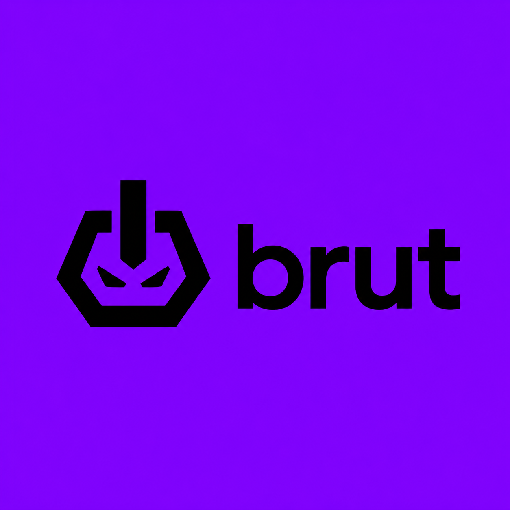

<div align="center">
  
  &nbsp;&nbsp;&nbsp;&nbsp;
  
</div>

<h1 align="center">BRUT Compiler</h1>

<p align="center">
  A custom compiler and VS Code extension for the BRAT programming language.
</p>

<p align="center">
  <b>BRAT</b> = the language you write &nbsp; | &nbsp; <b>BRUT</b> = the compiler that runs it
</p>

---

**BRUT Compiler** is a Visual Studio Code extension for writing, checking, and running **BRAT** `.brt` files directly inside VS Code.

BRAT is an English-like beginner-friendly programming language designed to feel simple, readable, and fun while still supporting real programming concepts like variables, input, conditions, loops, arithmetic, and logic.

BRAT is not meant to feel boring or robotic. It is built with personality: clean syntax, readable logic, easy loops, and funny GenZ-style compiler error messages that still explain the real issue clearly.

---

## What is BRAT?

**BRAT** is the programming language.

BRAT files use the extension:

```text
.brt
```

Example:

```brat
show("Hello from BRAT!");
```

---

## What is BRUT?

**BRUT** stands for:

```text
Base Runtime Unified Translator
```

BRUT is the compiler system that reads BRAT code, checks it, translates it, and runs it.

Simple meaning:

```text
BRAT = the language you write
BRUT = the compiler that runs it
```

---

## Features

This extension adds BRAT support to VS Code.

### Included Features

* `.brt` file recognition
* BRAT syntax highlighting
* BRAT file icon
* BRUT Compiler logo
* Top-right Run button
* Command Palette run command
* Command Palette check command
* BRAT snippets
* Bundled BRUT compiler runtime
* Terminal-based execution for interactive programs
* Support for user input through `ask(...)`
* Support for `while` loops
* Support for beginner-friendly `repeat ... times` loops
* Sassy GenZ-style BRAT error messages
* Helpful error reports with line number, column number, error code, issue, and fix suggestion

---

## Requirements

Before using this extension, make sure Python is installed.

### Required

```text
Python 3.10 or higher
Visual Studio Code
```

Check Python installation:

```powershell
python --version
```

If Python is installed correctly, it should show something like:

```text
Python 3.10.x
```

---

## Installation

### Install from VSIX

After building the extension, you will get a file like:

```text
brut-compiler-0.0.1.vsix
```

To install it:

1. Open Visual Studio Code.
2. Go to the Extensions tab.
3. Click the three dots menu.
4. Select:

```text
Install from VSIX
```

5. Choose:

```text
brut-compiler-0.0.1.vsix
```

6. Reload VS Code if asked.

---

## How to Use

Create or open a BRAT file:

```text
calculator.brt
main_test.brt
hello.brt
repeat_test.brt
```

When the file opens, VS Code should detect it as:

```text
BRAT
```

You should see a Run button at the top-right of the editor.

Click:

```text
▶ Run
```

The extension will run the file using the BRUT Compiler.

---

## Commands

You can also use the Command Palette.

Open Command Palette:

```text
Ctrl + Shift + P
```

Search:

```text
BRUT
```

Available commands:

```text
BRUT: Run
BRUT: Check BRAT File
```

---

## BRAT Language Syntax

This section explains the currently supported BRAT language syntax.

---

# 1. Output

Use `show(...)` to print something.

```brat
show("Hello, BRAT!");
```

Output:

```text
Hello, BRAT!
```

You can print text, numbers, variables, or expressions.

```brat
let name = "JINX";
show(name);
```

```brat
let total = 10 + 5;
show(total);
```

---

# 2. Variables

BRAT supports variables using `let` and `mut`.

---

## `let`

Use `let` to create a variable.

```brat
let language = "BRAT";
let score = 100;
let active = aura.true;
```

Example:

```brat
let x = 10;
let y = 20;

show(x + y);
```

---

## `mut`

Use `mut` when the value should be changed later.

```brat
mut count = 0;
count = count + 1;

show(count);
```

Example:

```brat
mut points = 10;
points = points + 5;

show(points);
```

---

# 3. Data Types

BRAT supports the following basic values.

---

## Numbers

```brat
let age = 20;
let price = 99.5;
```

---

## Strings

Strings are written inside double quotes.

```brat
let name = "Anam";
show("Welcome to BRAT!");
```

---

## Booleans

BRAT uses aura-style booleans.

```brat
let isRunning = aura.true;
let isFinished = aura.false;
```

Meaning:

```text
aura.true  = true
aura.false = false
```

---

# 4. Input

Use `ask(...) -> variable;` to take input from the user.

```brat
ask("Enter your name") -> name;
show(name);
```

Example:

```brat
show("Welcome!");

ask("Enter first number") -> a;
ask("Enter second number") -> b;

show("Answer:");
show(a + b);
```

The BRUT compiler automatically tries to understand numeric input.

If the user enters:

```text
10
```

BRAT treats it as a number.

If the user enters:

```text
Anam
```

BRAT treats it as text.

---

# 5. Arithmetic Operators

BRAT supports common arithmetic operations.

| Operator | Meaning        | Example  |
| -------- | -------------- | -------- |
| `+`      | Addition       | `a + b`  |
| `-`      | Subtraction    | `a - b`  |
| `*`      | Multiplication | `a * b`  |
| `/`      | Division       | `a / b`  |
| `%`      | Remainder      | `a % b`  |
| `**`     | Power          | `a ** b` |

Example:

```brat
let a = 10;
let b = 3;

show(a + b);
show(a - b);
show(a * b);
show(a / b);
show(a % b);
show(a ** b);
```

---

# 6. Comparison Operators

Comparison operators are used in conditions.

| Operator | Meaning                  |
| -------- | ------------------------ |
| `==`     | Equal to                 |
| `!=`     | Not equal to             |
| `>`      | Greater than             |
| `<`      | Less than                |
| `>=`     | Greater than or equal to |
| `<=`     | Less than or equal to    |

Example:

```brat
let score = 85;

if score >= 50 {
    show("Passed");
}
else {
    show("Failed");
};
```

---

# 7. Logical Operators

BRAT supports logical conditions.

| Operator | Meaning                             |
| -------- | ----------------------------------- |
| `and`    | Both conditions must be true        |
| `or`     | At least one condition must be true |
| `not`    | Reverses the condition              |

Example:

```brat
let score = 90;
let attendance = 80;

if score >= 50 and attendance >= 75 {
    show("Allowed");
}
else {
    show("Not allowed");
};
```

Example with `or`:

```brat
let choice = 1;

if choice == 1 or choice == 2 {
    show("Valid choice");
}
else {
    show("Invalid choice");
};
```

---

# 8. If / Else Conditions

Use `if` and `else` to make decisions.

```brat
if condition {
    show("Condition is true");
}
else {
    show("Condition is false");
};
```

Example:

```brat
ask("Enter your marks") -> marks;

if marks >= 50 {
    show("You passed!");
}
else {
    show("You failed.");
};
```

---

# 9. While Loops

Use `while` to repeat code while a condition is true.

```brat
mut count = 1;

while count <= 5 {
    show(count);
    count = count + 1;
};
```

Output:

```text
1
2
3
4
5
```

Use `while` when you want the loop to keep running until a condition becomes false.

---

# 10. Repeat Loops

Use `repeat ... times` when you want a loop that is easy to read.

This is one of the main reasons BRAT exists: loops should feel understandable.

```brat
repeat 3 times {
    show("BRAT repeat is working");
};
```

Output:

```text
BRAT repeat is working
BRAT repeat is working
BRAT repeat is working
```

You can also use a variable as the repeat count.

```brat
ask("How many times should BRAT repeat") -> repeatCount;

repeat repeatCount times {
    show("This line is repeating.");
};
```

Important:

```text
times is a BRAT keyword.
```

So do not use `times` as a variable name.

Do not write this:

```brat
ask("How many times") -> times;

repeat times times {
    show("hi");
};
```

Use this instead:

```brat
ask("How many times") -> repeatCount;

repeat repeatCount times {
    show("hi");
};
```

---

# 11. Repeat Loop Example

```brat
show("========================================");
show("        BRAT REPEAT LOOP TEST           ");
show("========================================");

ask("How many times should BRAT repeat") -> repeatCount;

repeat repeatCount times {
    show("🔥 BRAT repeat loop is working!");
};

show("");
show("Done. Loops are finally readable.");
```

---

# 12. Assignments

Variables can be updated after creation.

```brat
mut x = 10;
x = 20;

show(x);
```

Example:

```brat
mut total = 0;

total = total + 5;
total = total + 10;

show(total);
```

---

# 13. Blocks

BRAT uses curly braces for blocks.

Blocks are used in:

```text
if
else
while
repeat
```

Example:

```brat
if aura.true {
    show("This runs");
}
else {
    show("This does not run");
};
```

Example with `repeat`:

```brat
repeat 2 times {
    show("Inside repeat block");
};
```

---

# 14. Semicolons

Most BRAT statements end with a semicolon.

```brat
show("Hello");
let x = 10;
x = x + 1;
```

Blocks also end with a semicolon after the closing brace.

```brat
while x < 5 {
    show(x);
    x = x + 1;
};
```

```brat
if x > 5 {
    show("big");
}
else {
    show("small");
};
```

```brat
repeat 3 times {
    show("looping");
};
```

---

# 15. BRAT Error Handling

BRAT’s error system is designed to be useful, but not boring.

Instead of plain robotic compiler errors, BRAT gives readable error messages with personality.

A BRAT error can include:

```text
Line number
Column number
Error code
Actual issue
Fix suggestion
A funny BRAT-style roast
```

Example missing semicolon error:

```text
BRAT had a breakdown at line 3 💀
You probably forgot a semicolon `;`, shawty.

Error Code : BRAT_PARSE_003
Line       : 3
Column     : 1
Issue      : Expected `;` after show/say statement.

Fix it, fineshyt. BRAT is watching 👀
```

BRAT does not display every roast line every time. The messages are distributed across different types of errors so the compiler feels more natural.

Possible BRAT-style error lines include:

```text
BRAT had a breakdown at line 4 💀
it couldn't pass the vibe check
Bestie, this is not giving.
Bruh… didn’t expect such an error from you.
This is not a bug. This is a cry for help.
You probably forgot a semicolon `;`, shawty.
Fix it, fineshyt. BRAT is watching 👀
```

Different error types can trigger different messages.

| Error Type             | Example BRAT Message                          |
| ---------------------- | --------------------------------------------- |
| Missing semicolon      | `You probably forgot a semicolon ;, shawty.`  |
| Missing syntax         | `This is not a bug. This is a cry for help.`  |
| Parser error           | `Bestie, this is not giving.`                 |
| Lexical error          | `it couldn't pass the vibe check`             |
| Semantic error         | `Bruh… didn’t expect such an error from you.` |
| General compiler error | `This is not a bug. This is a cry for help.`  |

The goal is simple:

```text
Make errors funny, memorable, and still helpful.
```

---

# 16. Complete Example

```brat
show("========================================");
show("          BRAT DEMO PROGRAM             ");
show("========================================");

ask("Enter your name") -> name;
ask("Enter your score") -> score;

show("");
show("Welcome:");
show(name);

if score >= 50 {
    show("You passed.");
}
else {
    show("You failed.");
};

show("");
show("Repeat celebration:");

repeat 3 times {
    show("BRAT is running with aura.");
};

mut count = 1;

while count <= 3 {
    show("While loop running...");
    show(count);
    count = count + 1;
};
```

---

# 17. Calculator Example

```brat
show("========================================");
show("          BRAT SMART CALCULATOR          ");
show("========================================");
show("Not just a calculator.");
show("This is BRAT: English-like, clean, readable.");
show("Powered by aura.true logic and friendly syntax.");
show("========================================");

mut running = aura.true;

while running {
    show("");
    show("Choose what you want to do:");
    show("----------------------------------------");
    show("1 -> Add numbers");
    show("2 -> Subtract numbers");
    show("3 -> Multiply numbers");
    show("4 -> Divide numbers");
    show("5 -> Find remainder");
    show("6 -> Power calculation");
    show("7 -> BRAT vibe check");
    show("8 -> Repeat loop demo");
    show("0 -> Exit");
    show("----------------------------------------");

    ask("Enter your choice") -> choice;

    if choice == 0 {
        show("Goodbye from BRAT!");
        running = aura.false;
    }
    else {
        if choice == 1 {
            show("");
            show("Addition mode selected.");
            ask("Enter first number") -> a;
            ask("Enter second number") -> b;

            show("");
            show("Answer:");
            show(a + b);
        }
        else {
            if choice == 2 {
                show("");
                show("Subtraction mode selected.");
                ask("Enter first number") -> a;
                ask("Enter second number") -> b;

                show("");
                show("Answer:");
                show(a - b);
            }
            else {
                if choice == 3 {
                    show("");
                    show("Multiplication mode selected.");
                    ask("Enter first number") -> a;
                    ask("Enter second number") -> b;

                    show("");
                    show("Answer:");
                    show(a * b);
                }
                else {
                    if choice == 4 {
                        show("");
                        show("Division mode selected.");
                        ask("Enter first number") -> a;
                        ask("Enter second number") -> b;

                        if b == 0 {
                            show("Cannot divide by zero.");
                        }
                        else {
                            show("");
                            show("Answer:");
                            show(a / b);
                        };
                    }
                    else {
                        if choice == 5 {
                            show("");
                            show("Remainder mode selected.");
                            ask("Enter first number") -> a;
                            ask("Enter second number") -> b;

                            show("");
                            show("Answer:");
                            show(a % b);
                        }
                        else {
                            if choice == 6 {
                                show("");
                                show("Power mode selected.");
                                ask("Enter base") -> a;
                                ask("Enter power") -> b;

                                show("");
                                show("Answer:");
                                show(a ** b);
                            }
                            else {
                                if choice == 7 {
                                    show("");
                                    show("BRAT vibe check selected.");
                                    show("BRAT is clean, readable, and iconic.");
                                }
                                else {
                                    if choice == 8 {
                                        show("");
                                        show("Repeat loop demo selected.");
                                        ask("How many times should BRAT flex") -> repeatCount;

                                        repeat repeatCount times {
                                            show("BRAT repeat loop has aura.");
                                        };
                                    }
                                    else {
                                        show("");
                                        show("Invalid choice.");
                                        show("Please select a number from 0 to 8.");
                                    };
                                };
                            };
                        };
                    };
                };
            };
        };
    };
};
```

---

## Extension Folder Structure

A clean BRUT project structure looks like this:

```text
BRUT/
├── compiler/
│   ├── lexer.py
│   ├── parser.py
│   ├── ast_nodes.py
│   ├── tokens.py
│   ├── codegen_python.py
│   └── main.py
├── examples/
│   ├── calculator.brt
│   ├── main_test.brt
│   ├── repeat_test.brt
│   └── error_repeat_test.brt
├── generated/
├── tests/
└── brat-vscode-extension/
    ├── logo/
    │   ├── brat.png
    │   └── brut.png
    ├── out/
    ├── snippets/
    ├── src/
    ├── syntaxes/
    ├── language-configuration.json
    ├── package.json
    └── README.md
```

---

## Building the Extension

To build the extension locally:

```powershell
cd C:\Users\HP\Desktop\BRUT\brat-vscode-extension
npm run compile
```

---

## Creating the VSIX File

To package the extension as one installable file:

```powershell
cd C:\Users\HP\Desktop\BRUT
powershell -ExecutionPolicy Bypass -File .\build-vsix.ps1
```

This creates:

```text
brut-compiler-0.0.1.vsix
```

The `.vsix` file can be installed in VS Code.

---

## Installing the VSIX

1. Open VS Code.
2. Open the Extensions tab.
3. Click the three dots menu.
4. Choose:

```text
Install from VSIX
```

5. Select:

```text
brut-compiler-0.0.1.vsix
```

6. Reload VS Code.

---

## Running a BRAT File

Open any `.brt` file.

Click the top-right Run button:

```text
▶ Run
```

The terminal will show:

```text
BRUT Compiler
Running your BRAT file...
```

Then your BRAT program will run.

---

## Checking a BRAT File

Open Command Palette:

```text
Ctrl + Shift + P
```

Search:

```text
BRUT: Check BRAT File
```

This checks the BRAT file and reports whether it is valid.

---

## Testing Repeat Syntax

Create:

```text
examples/repeat_test.brt
```

Paste:

```brat
show("Repeat test");

repeat 3 times {
    show("BRAT repeat is working");
};
```

Run:

```powershell
python -m compiler.main examples/repeat_test.brt --run
```

Expected output:

```text
Repeat test
BRAT repeat is working
BRAT repeat is working
BRAT repeat is working
```

---

## Testing BRAT Roast Errors

Create:

```text
examples/error_repeat_test.brt
```

Paste this broken code:

```brat
show("Broken repeat test")

repeat 3 times {
    show("This should throw an error");
};
```

Run:

```powershell
python -m compiler.main examples/error_repeat_test.brt --run
```

Expected output style:

```text
BRAT had a breakdown at line 3 💀
You probably forgot a semicolon `;`, shawty.

Error Code : BRAT_PARSE_003
Line       : 3
Column     : 1
Issue      : Expected `;` after show/say statement.

Fix it, fineshyt. BRAT is watching 👀
```

---

## Troubleshooting

### BRAT command does not appear

Make sure the file extension is:

```text
.brt
```

Also check the bottom-right language mode in VS Code. It should say:

```text
BRAT
```

---

### Run button does not appear

Make sure the file is recognized as BRAT.

If not, click the bottom-right language mode and choose:

```text
BRAT
```

---

### Python not found

If the terminal says Python is not recognized, install Python or set the Python path in VS Code settings.

Search settings for:

```text
brat.pythonPath
```

Set it to:

```text
python
```

or:

```text
py
```

depending on your system.

---

### Calculator stopped with KeyboardInterrupt

This usually happens when the program was waiting for input and you stopped it manually.

To exit the calculator properly, enter:

```text
0
```

---

### .brt icon does not update

Reload VS Code:

```text
Ctrl + Shift + P
Developer: Reload Window
```

Make sure this file exists:

```text
logo/brat.png
```

---

### Repeat syntax throws an error

Make sure your compiler files include repeat support:

```text
tokens.py
ast_nodes.py
parser.py
codegen_python.py
```

Then rebuild the VSIX and reinstall it.

---

### VS Code still uses the old compiler

If repeat works in terminal but not in the VS Code extension, rebuild and reinstall the VSIX:

```powershell
cd C:\Users\HP\Desktop\BRUT
powershell -ExecutionPolicy Bypass -File .\build-vsix.ps1
```

Then install the new `.vsix` file again.

---

## Author

Created by:

```text
Anamta Gohar
```

---

## License

MIT License
